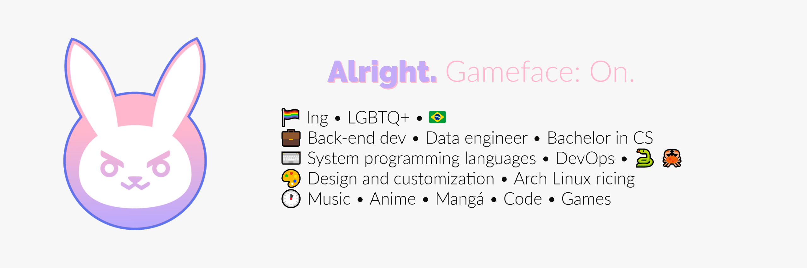

### DeFex — Software Engineer • Reverse Engineering • Systems Programming

---

### About

Software engineer at KHMNU @ DFXEDU with a focus on **systems programming**, **cybersecurity**, and **reverse engineering**. I build across the full stack — from Windows kernel drivers to Android native modules, from React web apps to Python automation tooling.

- Studying **Information Technologies & Cybersecurity**
- Researching kernel-mode Windows internals, anti-cheat bypass patterns, and IL2CPP runtime introspection
- Building tools that operate at the right level of abstraction for the problem

---

### Featured Projects

| Project | Description |
|---------|-------------|
| **[kernel-spyglass](https://github.com/DeFexNN/kernel-spyglass)** | Windows kernel security research lab — DKOM, minifilter, SSDT monitoring, BYOVD simulation |
| **[drivers-portfolio](https://github.com/DeFexNN/drivers-portfolio)** | Kernel driver suite — CR3 memory access, DSE bypass, manual PE mapper, VMProtect loader |
| **[NightcoreLiosImgui](https://github.com/DeFexNN/NightcoreLiosImgui)** | ImGui overlay for Unity Android — 3 injection variants, 100+ anti-cheat bypass patches |
| **[GGHACKS](https://github.com/DeFexNN/GGHACKS)** | Hybrid Android app — JNI/C++ with libcurl + OpenSSL, compile-time obfuscation |
| **[LumenInjector](https://github.com/DeFexNN/LumenInjector)** | Modular Android framework — Lua-native with encrypted ELF delivery, OpenGL ESP rendering |
| **[awesome-minis](https://github.com/DeFexNN/awesome-minis)** | Curated portfolio index — 18 projects across 6 engineering domains |

<b>All projects</b>

 

**Systems & Security:** kernel-spyglass · drivers-portfolio · NightcoreLiosImgui · GGHACKS · LumenInjector · DeFexGameGuardian · DeFexMenuV2 · DeFexPanel · DeFexUnpacker

**Web & Frontend:** my-portfolio · DeFexSite · Site · my-blog · ctf_site · medium-portfolio

**Automation:** PythonChannelBot · DeFexKomaru · 5rp_bot_executor · odoo-kanban-notifier · test_bot_deploy

**Academic:** MyEduProjs · 3pract

**Utilities:** ImGuiCalculator · Appium_Scripts · helensi_book_reader · SnowflakesDesktop · source · Vo1ic · temrava-reader · PyConverter · TikTokDownloader · jutsu-remote

---

 

